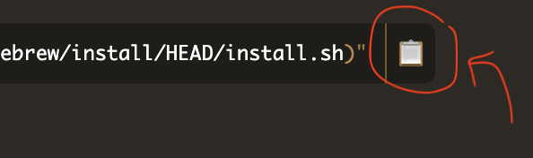
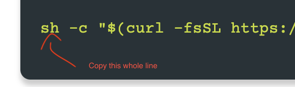

# Elizabeth Setup

## Install iTerm2

This is a Terminal replacement.

- [Download it](https://iterm2.com/) and install it
- Never open the built-in Terminal program again. It stinks
- Skim the highlights section and the general section in the docs. (You might want to look at them again later after you have used it for a while)

You now have a new Mac app called `iTerm`. To run it, enter &#8984;+Space and then type `iTerm`.

## Install HomeBrew

This is a package manager for Mac command line programs. It knows how to install command line programs (like Python).

- Open a new `iterm` window
- Copy the command they have on their [homepage](https://brew.sh/)

    

- Paste it into your `iterm` window (and hit Enter)
- Accept the default answer at any prompts
- Follow any instructions the script gives you
- Close your `iterm` window (you have to do this to make sure the Unix shell running in the terminal knows about new stuff)

You now have a new command-line program called `brew`.

## Install Oh My ZSH!

This is a Unix environment management doohickie that will make your life better in 10,000 ways.

- Open a new `iterm` window
- Copy the command on their [install page](https://ohmyz.sh/#install)

    

- Paste it into your `iterm` window (and hit Enter)
- Accept the default answer at any prompts
- Follow any instructions the script gives you
- Close your `iterm` window 

## Install Python :) 

Run this command (in the command line):

```zsh
brew install python3
```

## Install VisualStudio Code

This is your code editor/integrated development environment (IDE).

- Go to [their website](https://code.visualstudio.com/)
- Click the `Download` button
- Open the `.zip` file that is downloaded
- Drag the `Visual Studio Code` application into your `Applications` folder
- Enter &#8984;+Space and then type `Visual Studio Code`
- When it starts
  - Open the Command Palette (&#8984;+Shift+P)
  - Type 'shell command' to find the Shell Command: Install 'code' command in PATH command

      

- If you have any `iterm` windows open, close them

You can launch code as you did above or by typing `code .` on the command line.

## Update your `.zshrc`

- In an `iterm` window, run this command to open your home directory in `Visual Studio Code`

  ```zsh
  code ~/
  ```

- Find the file `.zshrc` in the file browser on the left-hand side of the screen and open it by double-clicking

- Set your `ZSH_THEME` to `af-magic`. This setting will be at or near line 11 (assuming you're using the same version of Oh My Zsh! I'm using and that you haven't inserted stuff at the top of your `.zshrc`):

  ```zsh
  ZSH_THEME="af-magic"
  ```

- Set your `plugins` as follows. This setting will be at or near line 73:

  ```zsh
  plugins=(git iterm2 pip pyenv pylint python)
  ```

- At the very bottom of the file, add the following line

  ```zsh
  PATH="$PATH:$(brew --prefix python)/libexec/bin"
  ```

- If you have any `iterm` windows open, close them

## Install VSCode Plugins

Look at [this article](https://learnpython.com/blog/visual-studio-code-extensions-for-python/) and install any of his recommendations that look interesting to you.

## Learning Python Tutorials

- [This article](https://www.intelligent.com/best-online-courses/python-classes/) rates several Python courses. Some are free some are not. [This bootcamp](https://www.udemy.com/course/complete-python-bootcamp) is from Udemy which is a vendor I've used before. It costs money. :cry:
- [This](https://www.pluralsight.com/search?q=python) is a listing of Python offerings from PluralSight. We use their stuff at work, and they're usually good courses. PluralSight is a subscription service. If you sign up, you pay $29/month for lots or courses or $45/month for every course in their catalog.

## Python Package Management Tutorial

- [This](https://packaging.python.org/en/latest/tutorials/managing-dependencies/) is the official Python docs on dependency management. It's okay if you kind of know what you're doing.
    - It gives a [list of other dependency management tools](https://packaging.python.org/en/latest/tutorials/managing-dependencies/#other-tools-for-application-dependency-management) that looks like it could useful, depending on how your projects are set up.
- [This](https://www.datacamp.com/tutorial/pip-python-package-manager) is a free, basic pip tutorial
- [This Udemy course](https://www.udemy.com/course/python-package) shows you how to build packages. If you really want to understand how package management works, something like this is useful.
- [This course from PluralSight](https://www.pluralsight.com/courses/managing-python-packages-virtual-environments) looks spot on for what you need to learn here.