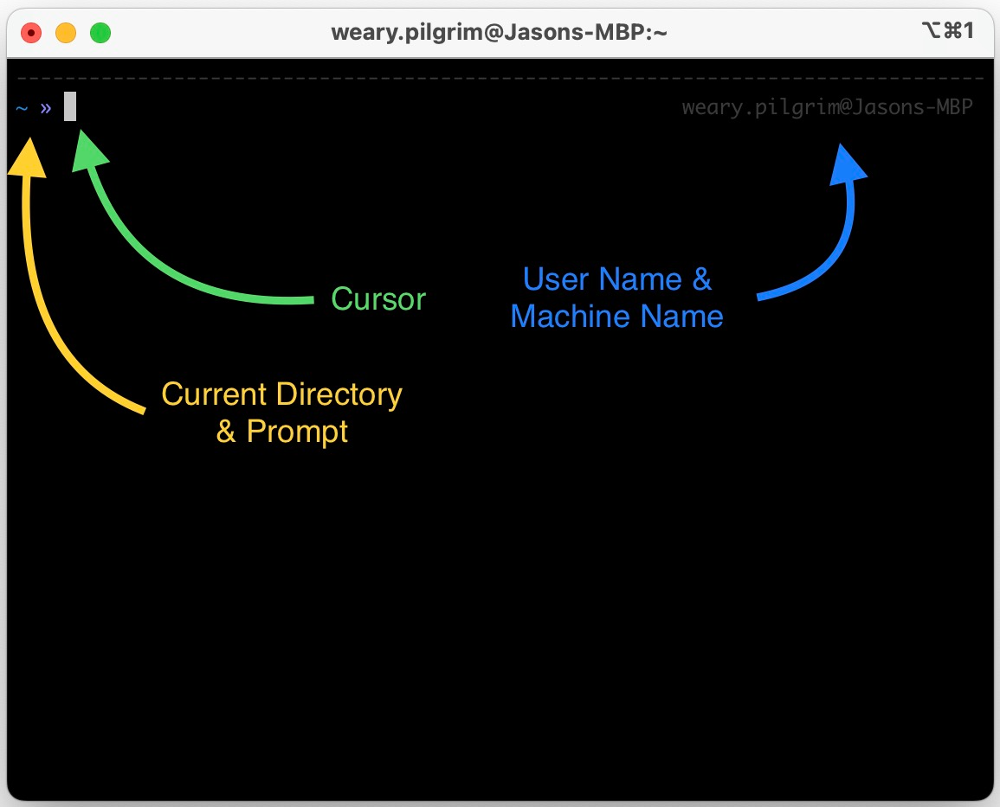

# Unix Exercises

This document is a combination of theory and practice. Some of the exercises are designed to build habits so you can work on the command line, so they will be kind of boring to do, but you'll benefit from them in the long run. Hopefully, there's enough theory to make the exercises make sense!

## Command Line Familiarization

> :warning: If you haven't followed the steps in the [README](./README.md), go do that before doing this! :warning:

Your Command line will look like something this:



| Item | Description|
|-|-|
| Current Directory | This is the directory you are curently "in." When you change directories with `cd` this valuye will change. <br> _Synonyms: current working directory, present working directory_ |
| Cursor | This blinky little guy is where letters you type will appear. |
| Prompt | This tells you that the command line is ready to listen to your typing. If you don't see a prompt, the command line isn't listening to you. |
| User Name | It's you! (Well, in the picture, it's me...) |
| Machine name | The name of the machine you're using. |

> :information_source: If you're not on a Mac, these things will look a bit different, but the basics will be the same.

## The File System and File Paths

The file system is exactly what it sounds like: the system that keeps track of all your files. The file system is the hierarchy of files and directories where all of your stuff lives.

It looks something like this:

```
/ <------------------------------- This is the "root" directory all other
│                                  directories and files are in here somewhere!
│
├── Users/ <---------------------- The "home" directories of all users on the
│   │                              machine live here.
│   │
│   ├── weary-pilgrim/ <---------- This is my home directory. I keep all my 
│   │   │                          things here.
│   │   │
│   │   ├── Documents/ <---------- I keep documents here (duh).
│   │   │
│   │   └── repos/ <-------------- All my cloned GitHub repos are here.
│   │       │
│   │       ├── DoomedLizard/ <--- I clone Elizabeth's repos here.
│   │       │
│   │       └── weary-pilgrim/ <-- I clone my repos here (including this one).
│   │
│   └── some-other-user/ <-------- If I created "some-other-user" on my machine
|                                  this would be  that user's home directory.
│
├── bin/ <------------------------ This is a built-in directory where Unix
│   │                              command-line programs are kept
│   │
│   ├── ls <---------------------- This lists the contents of a directory to the
│   │                              the screen.
│   │
│   └── zsh <--------------------- This is the program that actually gives you
│                                  the command line.
└── opt/
    └── homebrew/
        └── bin/ <---------------- This is the directory where Homebrew
            │                      installed python3
            │
            └── python3 <--------- Oh look! Here it is!
```

There are a few special directories that whose names you shoud know:

| Directory | Description | Command to Go There |
|-|-|-|
| `/` | This is the **root** directory. Be careful about changing things here! | `cd /` |
| `/Users/weary-pilgrim` | This is my **home** directory. It is where I should put all the things on this computer that belong to me. | `cd /Users/weary-pilgrim` (fully-qualified, absolute path) <br/> `cd ~` (`~` is a shortcut) <br/> `cd` (with no args, `cd` defaults to your home) |

> :information_source: On a Mac with a single hard drive, `/` usually maps to the `Macintosh HD`.
>
> If you open `Finder` and then select `Go -> Computer` and then double-click the `Macintosh HD` icon, this is the same directory as `/`.
>
> If you select `Go -> Home` this is the same location as `/Users/<your user id>`.

### Absolute Paths vs. Relative Paths

## Environment Variables

## My First Script!

## Command Resolution

### Aliases and Functions

## Unix Processes

### Environment Variables And Processes

## Stdout, Stderr, and Stdin

